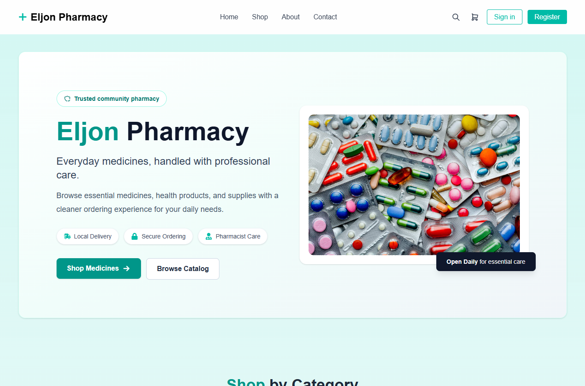

# Eljon Pharmacy

[](https://github.com/Ramenagii/EljonPharmacy/actions/workflows/ci.yml)

React pharmacy storefront with Supabase-backed sales recording and reporting.



## Project Location

The Vite application source lives in [`eljonp/`](./eljonp).

```bash
cd eljonp
npm install
copy .env.example .env.local
npm run dev
```

Fill `.env.local` with the Supabase values documented in [`eljonp/README.md`](./eljonp/README.md).

## Core Areas

- Customer shop and cart flow
- Supabase-backed checkout records
- Admin sign-in
- Manual sale recording
- Reporting screens

## Quality Gate

GitHub Actions runs install, audit, lint, tests, and production build checks on pushes and pull requests.
